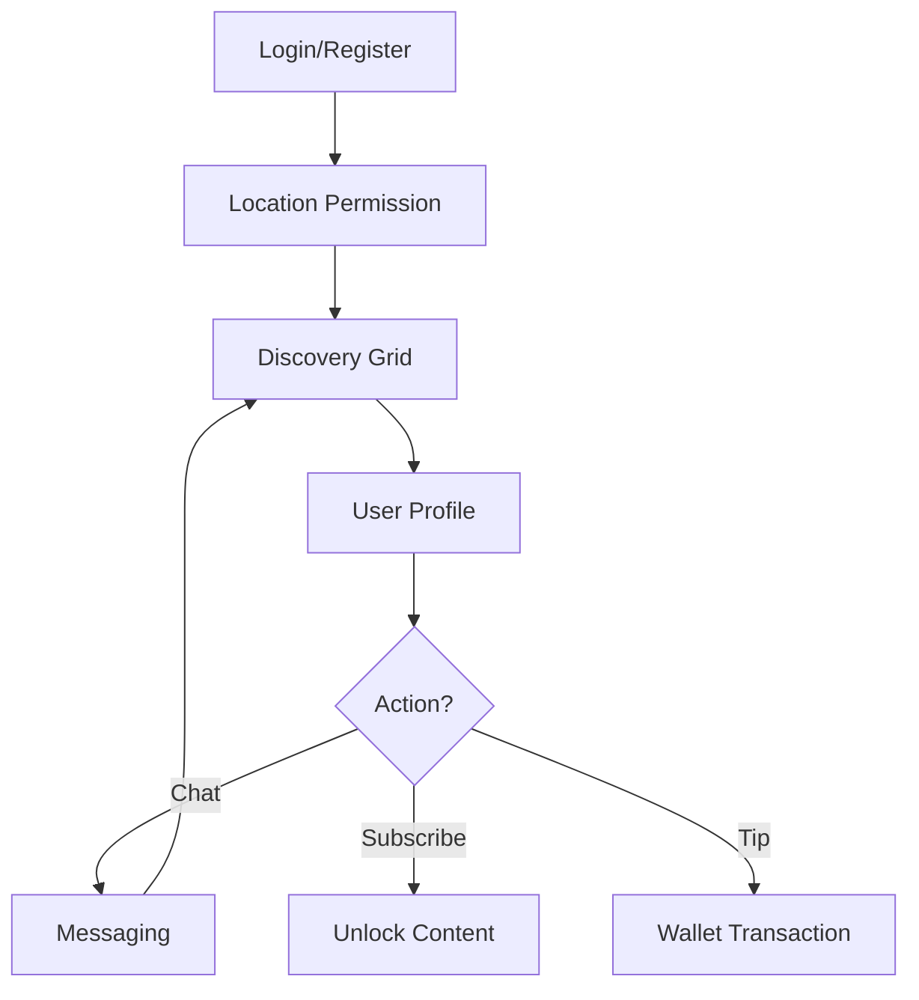

# Product Requirements Document: Transcend

## 1. Product Overview
Transcend is a location-based social discovery and content subscription platform that bridges the immediacy of dating apps with the creator economy. It allows users to discover people nearby for social connections while enabling creators to monetize exclusive content directly through their profiles.
**Target Value:** To empower authentic connections and financial independence by combining hyper-local discovery with direct-to-fan monetization.

## 2. Core Features

### 2.1 User Roles
| Role | Registration Method | Core Permissions |
|------|---------------------|------------------|
| **Explorer (User)** | Email/Social Login | Browse nearby profiles, chat (limited), purchase subscriptions/content. |
| **Creator** | ID Verification | All Explorer features + post exclusive content, set subscription rates, receive tips. |

### 2.2 Feature Module
Our platform requirements consist of the following main pages:
1.  **Discovery (Home)**: Location-based grid of users, filtering, and status updates.
2.  **Profile & Content**: User bio, public feed, and locked/exclusive media content.
3.  **Messaging**: Real-time chat, media sharing, and tipping mechanism.
4.  **Wallet & Settings**: Subscription management, earnings view, and account preferences.

### 2.3 Page Details
| Page Name | Module Name | Feature description |
|-----------|-------------|---------------------|
| **Discovery (Home)** | **The Grid** | Display users sorted by proximity. Infinite scroll. "Live" indicator for online users. |
| | **Filters** | Filter by distance, tags (e.g., "Creator", "Social"), and online status. |
| **Profile** | **Identity Header** | Profile picture, display name, distance, and short bio. "Subscribe" button for Creators. |
| | **Content Feed** | Tabbed view: "Public" (free) vs "Exclusive" (blurred/locked). Click to unlock/pay. |
| **Messaging** | **Chat Interface** | 1-on-1 text messaging. Send photos/videos (can be set as pay-to-view). |
| | **Tipping** | "Send Tip" button within chat or on profile to support creators directly. |
| **Wallet** | **Balance** | View current balance (for Creators) or payment methods (for Explorers). |
| **Auth** | **Onboarding** | Sign up/Login. Mandatory location permission request. |

## 3. Core Process
**Main User Flow:**
1.  User logs in and grants location access.
2.  User lands on the **Discovery Grid** to see who is nearby.
3.  User taps a profile to view details.
4.  If the profile is a Creator, the user can browse public pics or subscribe to see exclusive content.
5.  User initiates a chat or sends a tip.

## 4. User Interface Design

### 4.1 Design Style
*   **Aesthetic:** "Digital Noir" / Cyberpunk Luxury. Dark mode by default.
*   **Colors:** Deep Charcoal (#121212) background, Neon Purple (#A855F7) primary accent, Teal (#14B8A6) secondary accent.
*   **Typography:** Sans-serif, modern and geometric (e.g., Inter or Roboto).
*   **Layout:** Mobile-first, bottom navigation bar, edge-to-edge imagery.
*   **Vibe:** Mysterious, premium, and intimate.

### 4.2 Page Design Overview
| Page Name | Module Name | UI Elements |
|-----------|-------------|-------------|
| **Discovery** | The Grid | Masonry layout of user avatars. Distance badge in bottom-right of each card. |
| **Profile** | Header | Full-screen hero image with gradient overlay. Floating action button for "Subscribe". |
| **Content** | Locked Media | Blurred thumbnails with a "Lock" icon and price tag overlay. |

### 4.3 Responsiveness
*   **Mobile-First:** The interface is designed primarily for mobile web usage (PWA style) but adapts gracefully to desktop with a centered, app-like container.
*   **Touch:** Optimized for swipe gestures (e.g., swipe between profiles, swipe back).
