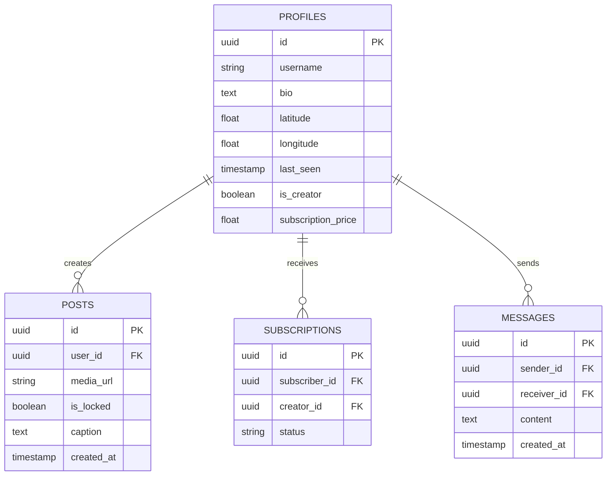

# Technical Architecture Document: Transcend

## 1. Architecture Design

We will use a modern, serverless-first architecture leveraging React for the frontend and Supabase for all backend services (Auth, Database, Storage, Realtime).

```mermaid
graph TD
  A[User Device (Mobile/Desktop)] --> B[React PWA]
  B --> C[Supabase Auth]
  B --> D[Supabase Database (PostgreSQL + PostGIS)]
  B --> E[Supabase Storage (Media)]
  B --> F[Supabase Realtime (Chat)]

  subgraph "Frontend"
      B
  end

  subgraph "Backend (Supabase)"
      C
      D
      E
      F
  end
```

## 2. Technology Description
*   **Frontend:** React@18 + TailwindCSS@3 + Lucide React (Icons) + Framer Motion (Animations).
*   **Initialization Tool:** `vite` (React + TypeScript).
*   **Backend:** Supabase (managed PostgreSQL).
*   **Maps/Location:** Browser Geolocation API + PostgreSQL PostGIS extension (for distance calculations).
*   **State Management:** React Context or Zustand.

## 3. Route Definitions
| Route | Purpose |
|-------|---------|
| `/` | Landing page (if not logged in) or redirect to Discovery. |
| `/login` | User authentication. |
| `/discover` | **Home**. Grid view of nearby users. |
| `/profile/:id` | Viewing another user's profile and content. |
| `/me` | Editing own profile and managing content. |
| `/messages` | List of active conversations. |
| `/messages/:id` | Direct chat room. |
| `/wallet` | Earnings and payment methods. |

## 4. API Definitions (Supabase Integration)

Since we are using Supabase directly from the client, we define the key data interactions rather than REST endpoints.

### 4.1 Core Data Interactions
*   **Auth:** `supabase.auth.signUp()`, `supabase.auth.signInWithPassword()`.
*   **Location Update:**
    *   Update `profiles` table with `latitude`, `longitude`, and `last_seen`.
*   **Fetch Nearby Users:**
    *   RPC call to a PostGIS function `get_nearby_users(lat, long, radius)`.
*   **Content:**
    *   Fetch posts: `supabase.from('posts').select('*').eq('user_id', id)`.
    *   Upload media: `supabase.storage.from('media').upload(...)`.

## 5. Data Model

### 5.1 Entity Relationship Diagram


### 5.2 Database Setup (DDL)
```sql
-- Enable PostGIS for location queries
create extension if not exists postgis;

-- Profiles Table
create table profiles (
  id uuid references auth.users on delete cascade primary key,
  username text unique,
  bio text,
  avatar_url text,
  is_creator boolean default false,
  subscription_price float default 0.0,
  location geography(POINT),
  last_seen timestamp with time zone default now()
);

-- Posts Table
create table posts (
  id uuid default gen_random_uuid() primary key,
  user_id uuid references profiles(id) on delete cascade,
  media_url text not null,
  caption text,
  is_locked boolean default false,
  created_at timestamp with time zone default now()
);

-- Messages Table
create table messages (
  id uuid default gen_random_uuid() primary key,
  sender_id uuid references profiles(id),
  receiver_id uuid references profiles(id),
  content text,
  created_at timestamp with time zone default now()
);
```
